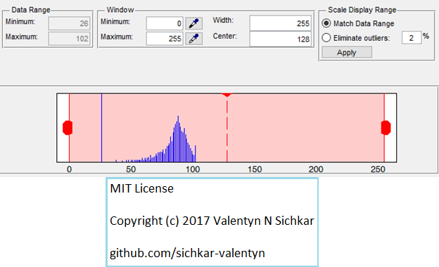

# Matlab Functions and Spatial Techniques for Image Processing
Spatial techniques for image processing in Matlab

### Courses:
* Explore the course **"Convolutional Neural Networks for Image Classification"** here: https://stepik.org/course/53801/promo

### Reference to:
[1] Valentyn N Sichkar. Spatial techniques for image processing in Matlab // GitHub platform [Electronic resource]. URL: https://github.com/sichkar-valentyn/Matlab_Functions_and_Spatial_Techniques_for_Image_Processing (date of access: XX.XX.XXXX)

## Description
Learning Matlab's functions for Spatial image processing techniques.

Spatial techniques for image processing:

<ul>
<li>Contrast Stretching</li>
<li>Noise Filtering</li>
<li>Histogram Modification</li>
</ul>

## Dividing an Image by a Constant Factor y = x/2

## Enhancing contrast using histogram equalization

## Getting histogram of image data

## Showing Adjust Contrast Tool for the image

## Complementing the image

## Adjusting image intensity values using gamma

## MIT License
## Copyright (c) 2017 Valentyn N Sichkar
## github.com/sichkar-valentyn
### Reference to:
[1] Valentyn N Sichkar. Spatial techniques for image processing in Matlab // GitHub platform [Electronic resource]. URL: https://github.com/sichkar-valentyn/Matlab_Functions_and_Spatial_Techniques_for_Image_Processing (date of access: XX.XX.XXXX)
